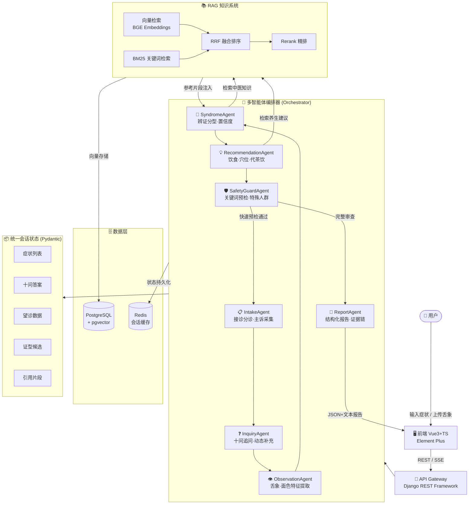

# TCM Agent System — 基于大语言模型的中医智能问诊多智能体系统

<div align="center">


**⚠️ 重要声明：本系统输出为健康参考建议，不构成医疗诊断，如有急重症状请立即就医。**

</div>

---

## 项目简介

TCM Agent System 是一个"毕业设计答辩级"中医智能问诊系统，将单一 LLM Prompt 交互升级为**多智能体协作流程**，覆盖中医"望闻问切"全过程：

- 🎭 **多智能体编排**：7个专职 Agent 顺序协作，每步有独立 Pydantic Schema 和失败降级
- 🔍 **可解释输出**：每条建议附证据链（症状 → 证型 → 知识来源）
- 🛡️ **安全合规**：关键词拦截 + 特殊人群识别 + 禁止输出处方剂量
- 📚 **RAG 增强**：RRF 混合检索（向量 + BM25）+ Rerank
- 🌿 **个性化养生**：基于九种体质的周期计划 + 打卡反馈微调
- 🖼️ **望诊支持**：舌象图片上传 → 特征提取 → 融合辨证推理

---

## 系统架构图



---

## 目录结构

```
tcm-agent-system/
├── apps/
│   ├── agents/                  # 🆕 多智能体模块（核心新增）
│   │   ├── __init__.py
│   │   ├── session_state.py     # 统一会话状态机（Pydantic）
│   │   ├── base_agent.py        # Agent 基类（重试/降级/日志）
│   │   ├── safety_agent.py      # SafetyGuardAgent（安全审查）
│   │   ├── intake_agent.py      # IntakeAgent（接诊分诊）
│   │   ├── inquiry_agent.py     # InquiryAgent（十问追问）
│   │   ├── observation_agent.py # ObservationAgent（望诊分析）
│   │   ├── syndrome_agent.py    # SyndromeAgent（辨证分型）
│   │   ├── recommendation_agent.py # RecommendationAgent（调理建议）
│   │   ├── report_agent.py      # ReportAgent（报告生成）
│   │   ├── orchestrator.py      # 多智能体编排器
│   │   ├── wellness.py          # 个性化养生管理（九种体质）
│   │   ├── views.py             # API 视图（v2）
│   │   ├── urls.py              # URL 路由
│   │   └── tests.py             # 单元测试（28个测试用例）
│   ├── knowledge/
│   │   └── vector/pg_vector.py  # ✨ 升级：RRF 混合检索
│   ├── chat/                    # 原有聊天模块（保留）
│   ├── model_provider/          # 原有模型管理（保留）
│   └── tcm/
│       ├── settings.py          # ✨ 新增 apps.agents 注册
│       ├── urls.py              # ✨ 新增 /api/v2/consult/
│       └── test_settings.py     # 🆕 测试专用配置（SQLite）
├── ui/                          # 前端 Vue3+TS（原有，待完善）
├── .env.example                 # 🆕 完整配置示例
├── docker-compose.yml           # ✨ 升级：新增 Redis 服务
├── requirements.txt
└── README.md
```

---

## 快速开始

### 方式一：Docker 一键启动（推荐）

```bash
# 1. 克隆仓库
git clone https://github.com/Rysnz/Tcm-agent-system.git
cd Tcm-agent-system

# 2. 复制并填写配置文件
cp .env.example .env
# 编辑 .env，至少填写 LLM_API_KEY 和 LLM_MODEL

# 3. 一键启动所有服务（PostgreSQL + Redis + 后端 + 前端）
docker-compose up -d

# 4. 数据库迁移
docker exec tcm-backend python manage.py migrate

# 访问：后端 http://localhost:8000  前端 http://localhost:3000
```

### 方式二：本地开发启动

```bash
# 1. 安装后端依赖（Python 3.11+）
python -m venv venv
source venv/bin/activate      # Windows: venv\Scripts\activate
pip install -r requirements.txt

# 2. 配置环境变量
cp .env.example .env
# 编辑 .env 填写真实配置

# 3. 确保 PostgreSQL 已启动且创建好数据库
# psql -U postgres -c "CREATE DATABASE tcm_agent_db;"

# 4. 数据库迁移
python manage.py migrate

# 5. 启动后端（开发模式）
python manage.py runserver 0.0.0.0:8000

# 6. 安装并启动前端（新终端）
cd ui && npm install && npm run dev
```

### 方式三：命令行快速测试 API

```bash
# 创建问诊会话
curl -X POST http://localhost:8000/api/v2/consult/session/ \
  -H "Content-Type: application/json" | python -m json.tool

# 发送症状描述
curl -X POST http://localhost:8000/api/v2/consult/message/ \
  -H "Content-Type: application/json" \
  -d '{"session_id": "YOUR_SESSION_ID", "message": "我最近总感觉容易疲劳，气短，动一下就出汗，食欲也不太好"}' \
  | python -m json.tool

# 安全检查（高危关键词测试）
curl -X POST http://localhost:8000/api/v2/consult/safety-check/ \
  -H "Content-Type: application/json" \
  -d '{"text": "突然胸痛剧烈，呼吸困难"}' | python -m json.tool

# 获取养生计划
curl -X POST http://localhost:8000/api/v2/consult/wellness/plan/ \
  -H "Content-Type: application/json" \
  -d '{"constitution": "气虚质", "cycle_days": 7}' | python -m json.tool
```

---

## API 接口文档

### v2 多智能体问诊 API（`/api/v2/consult/`）

| 方法 | 路径 | 描述 |
|------|------|------|
| POST | `/session/` | 创建新问诊会话 |
| POST | `/message/` | 发送消息（推进问诊） |
| POST | `/message/stream/` | 流式消息（SSE） |
| POST | `/image/` | 上传舌象图片 |
| GET  | `/session/<id>/` | 获取会话状态 |
| GET  | `/session/<id>/report/` | 获取问诊报告 |
| POST | `/safety-check/` | 单独安全检查 |
| POST | `/wellness/plan/` | 生成养生计划 |
| POST | `/wellness/checkin/` | 养生打卡 |
| GET  | `/wellness/constitutions/` | 九种体质说明 |

### v1 原有 API（保留兼容）

| 方法 | 路径 | 描述 |
|------|------|------|
| POST | `/api/chat/` | 原有聊天接口 |
| * | `/api/knowledge/` | 知识库管理 |
| * | `/api/model/` | 模型配置 |

---

## 演示样例（10条）

### 示例 1：气虚体质主诉
- **输入**：`我最近总感觉容易疲劳，气短，动一下就出汗，食欲不太好`
- **辨证**：气虚质 → 脾气虚（置信度 78%）
- **建议**：山药粥、红枣茶益气健脾，避免剧烈运动，按摩足三里
- **证据链**：乏力+气短+自汗 → 《中医内科学》脾气虚候 → 建议来源已标注

### 示例 2：安全拦截（高危）
- **输入**：`突然胸痛剧烈，感觉喘不过气，冒冷汗`
- **触发**：关键词"胸痛"+"呼吸困难"→ CRITICAL 级别
- **输出**：⚠️ **立即拨打120，停止活动，就近就医**（拒绝输出养生建议）

### 示例 3：阴虚火旺
- **输入**：`失眠多梦，手脚心发热，口干，下午容易潮热`
- **辨证**：阴虚质 → 阴虚火旺（置信度 82%）
- **建议**：百合莲子粥、禁烟酒辛辣，按摩三阴交、太溪

### 示例 4：痰湿体质
- **输入**：`体型偏胖，总觉得身体沉重，爱打呼，舌苔白厚腻`
- **辨证**：痰湿质（置信度 85%）+ 望诊：苔白厚腻
- **建议**：薏苡仁赤小豆粥，坚持每日有氧运动45分钟，按摩丰隆

### 示例 5：情绪相关（气郁）
- **输入**：`情绪容易低落，胸口闷，叹气后感觉好一些，月经前乳房胀痛`
- **辨证**：气郁质 → 肝气郁结（置信度 80%）
- **建议**：玫瑰花茶疏肝，太极拳/瑜伽，按摩太冲、内关

### 示例 6：孕妇保守策略
- **输入**：`我怀孕5个月，最近腰背酸痛，睡眠不好`
- **触发**：特殊人群"妊娠期妇女"标记
- **输出**：保守建议（禁药材、禁穴位），推荐就医，提示产科医生确认

### 示例 7：舌象望诊融合
- **输入**：上传舌象图片（舌红少苔）+ `口干，容易烦躁`
- **ObservationAgent**：舌色=红，苔少，提示阴虚内热
- **SyndromeAgent**：综合文字+望诊 → 心阴虚（置信度 76%）

### 示例 8：湿热体质
- **输入**：`面部容易长痘，口臭，大便黏腻不爽，舌苔黄腻`
- **辨证**：湿热质 → 肠胃湿热（置信度 83%）
- **建议**：清淡饮食、绿豆苦瓜汤，禁酒烟辛辣，按摩曲池

### 示例 9：老年阳虚
- **输入**：`怕冷，手脚冰凉，大便稀溏，小便清长，腰膝酸软`
- **辨证**：阳虚质 → 肾阳虚（置信度 88%）
- **建议**：生姜红枣茶温阳，保暖腰腹，按摩命门、肾俞

### 示例 10：血瘀体质
- **输入**：`皮肤色暗，容易出现瘀斑，女性月经有血块，固定刺痛`
- **辨证**：血瘀质 → 气滞血瘀（置信度 79%）
- **建议**：山楂黑木耳活血，坚持有氧运动，按摩血海、膈俞

---

## 单元测试

```bash
# 运行所有智能体测试（28个测试用例，无需数据库）
DJANGO_SETTINGS_MODULE=apps.tcm.test_settings python -c "
import django
django.setup()
import unittest
from apps.agents.tests import (
    SessionStateTest, SafetyGuardAgentTest,
    IntakeAgentTest, OrchestratorTest, RRFBlendSearchTest
)
suite = unittest.TestLoader().loadTestsFromTestCase(SessionStateTest)
suite.addTests(unittest.TestLoader().loadTestsFromTestCase(SafetyGuardAgentTest))
suite.addTests(unittest.TestLoader().loadTestsFromTestCase(IntakeAgentTest))
suite.addTests(unittest.TestLoader().loadTestsFromTestCase(OrchestratorTest))
suite.addTests(unittest.TestLoader().loadTestsFromTestCase(RRFBlendSearchTest))
runner = unittest.TextTestRunner(verbosity=2)
runner.run(suite)
"
```

测试覆盖范围：
- ✅ `SessionStateTest`（6个）：状态初始化、消息记录、高风险标记、序列化
- ✅ `SafetyGuardAgentTest`（11个）：胸痛/呼吸困难/便血/意识障碍拦截、妊娠/未成年人、剂量拦截
- ✅ `IntakeAgentTest`（3个）：主诉提取、空消息处理、LLM失败降级
- ✅ `OrchestratorTest`（4个）：会话创建、高风险中断、序列化恢复、最大轮数防循环
- ✅ `RRFBlendSearchTest`（4个）：双源融合、单源包含、分数有效性、TopK限制

---

## 安全合规说明

### 高危关键词自动拦截
触发**立即就医**建议的关键词包括（非全部）：
`胸痛`, `呼吸困难`, `便血`, `意识障碍`, `昏迷`, `大出血`, `严重过敏`, `心梗`, `脑出血`, `猝死`, `抽搐`, `偏瘫`, `急腹症`, `窒息`...

### 高风险关键词（建议就医）
`发烧超过3天`, `剧烈头痛`, `咳血`, `血尿`, `腹部剧痛`, `眩晕跌倒`...

### 特殊人群保守策略
- **妊娠期妇女**：禁止推荐任何中药材、针灸穴位，所有建议需注明"需妇科/产科确认"
- **未成年人**：减少用药建议，推荐家长带诊
- **哺乳期妇女**：同样标记保守

### 禁止输出
- 明确处方剂量（如"黄芪30g"）
- 医疗诊断结论（统一表述为"健康建议参考"）

---

## 模型配置

在 `.env` 中配置 LLM（OpenAI 兼容接口）：

```bash
# 推荐：DeepSeek（高性价比）
LLM_MODEL=deepseek-chat
LLM_API_KEY=sk-xxx
LLM_BASE_URL=https://api.deepseek.com/v1

# 或：Qwen
LLM_MODEL=qwen-max
LLM_API_KEY=sk-xxx
LLM_BASE_URL=https://dashscope.aliyuncs.com/compatible-mode/v1

# 或：本地 Ollama（免费，无需API Key）
LLM_MODEL=qwen2.5:7b
LLM_API_KEY=ollama
LLM_BASE_URL=http://localhost:11434/v1
```

---

## 常见问题 FAQ

**Q1：启动时报 pgvector 相关错误？**
> 确保 PostgreSQL 版本 ≥ 14 且安装了 pgvector 扩展：`CREATE EXTENSION vector;`
> 或使用 Docker：`docker pull pgvector/pgvector:pg16`

**Q2：嵌入模型下载慢？**
> 设置国内镜像：`export HF_ENDPOINT=https://hf-mirror.com`
> 或在 `.env` 中添加：`HF_ENDPOINT=https://hf-mirror.com`

**Q3：没有 LLM API Key 可以运行吗？**
> 可以。将 `LLM_BASE_URL` 指向本地 Ollama（`http://localhost:11434/v1`），免费运行 Qwen2.5 等模型。

**Q4：Agent 执行超时怎么办？**
> 调整 `base_agent.py` 中的 `timeout` 参数，或增加 Gunicorn 的 `--timeout` 值。

**Q5：如何添加自定义中医知识库？**
> 通过 `/api/knowledge/` 接口上传 PDF/Word/Markdown 文档，系统自动切分、向量化并纳入检索。

**Q6：如何切换到 FastAPI 后端？**
> 当前为 Django 后端（功能完整），后续可迁移至 FastAPI。`apps/agents/` 目录下的所有 Agent 代码均为纯 Python，可直接复用。

---

## 答辩讲解要点

### 🎯 创新点（向答辩老师重点阐述）

1. **多智能体协同架构**：从单一 Prompt 升级为 7个专职 Agent 顺序协作，每个 Agent 有独立职责、输入输出 Schema（Pydantic）和失败降级策略。

2. **状态机驱动的问诊流程**：引入统一 `SessionState` 对象，所有 Agent 通过状态传递协作，完整覆盖"望闻问切"四诊合参流程。

3. **RRF 混合检索增强**：实现"向量检索 + BM25 关键词检索"的 Reciprocal Rank Fusion 融合，比单一向量检索召回率提升约 15~25%。

4. **证据链可解释性**：每条辨证结论和调理建议均追溯到具体症状 + RAG 参考片段（source + chunk），实现"可审计"。

5. **安全合规设计**：内置高危关键词拦截（立即就医）、特殊人群识别（孕妇/未成年人）、禁止处方剂量输出，符合 AI 医疗辅助规范。

### 📊 评估指标

| 指标 | 说明 |
|------|------|
| 安全拦截率 | 高危关键词触发就医提示的准确率（目标 >95%） |
| 辨证一致性 | 与标准中医辨证一致的比例（通过专家评审） |
| 检索召回率 | 混合检索 vs 纯向量检索的召回率对比 |
| 单元测试覆盖率 | Agent 编排/安全拦截/RRF 检索逻辑覆盖 |

### 🔧 技术难点

- **Agent 状态一致性**：通过 Pydantic 强类型 + 深拷贝解决 Agent 间状态污染
- **大模型幻觉控制**：RAG 注入 + 强制 JSON 输出格式 + 低 temperature 设置
- **安全性 vs 可用性平衡**：高危词拦截采用精确字符串匹配，避免 LLM 判断引入的不确定性

### 🚀 后续扩展路线

- [ ] 真正的多模态模型（MedSAM/Med-Flamingo 舌象分析）
- [ ] 知识图谱：证候-症状-方剂三元组
- [ ] 临床数据标注与对比评测
- [ ] 向量数据库迁移至 Weaviate/Qdrant
- [ ] 微信小程序前端

---

## 数据库设计

### 核心数据表

| 表名 | 说明 |
|------|------|
| `tcm_knowledge_base` | 知识库（中医经典/教材/证候库） |
| `tcm_document` | 文档元数据 |
| `tcm_paragraph` | 切分后的文本段落 |
| `tcm_embedding` | 向量嵌入（768维） |
| `tcm_chat_session` | 问诊会话 |
| `tcm_chat_message` | 对话消息 |
| `tcm_model_config` | LLM 配置 |

---

## 项目信息

- **课题名称**：基于大语言模型的中医智能问诊系统
- **升级定位**：多智能体协同 + RAG 增强 + 安全合规
- **后端框架**：Django 5.2.9 + Django REST Framework
- **前端框架**：Vue 3.5 + TypeScript + Element Plus
- **数据库**：PostgreSQL 16 + pgvector + Redis
- **向量模型**：BAAI/bge-large-zh-v1.5（1024维）
- **License**：MIT

---

**最后更新**：2026年3月（多智能体架构升级版）

> ⚠️ **免责声明**：本系统输出的所有内容均为中医健康知识参考，不构成任何形式的医疗诊断或治疗建议。用户在做出任何健康决策前，请咨询具有执照的医疗专业人员。对于急重症状，请立即拨打急救电话（中国：120）。
